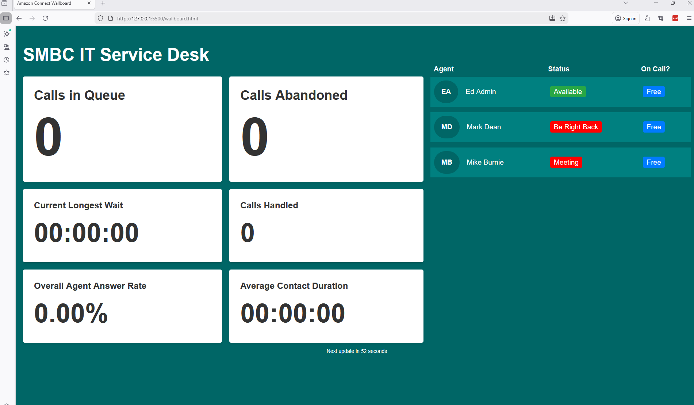
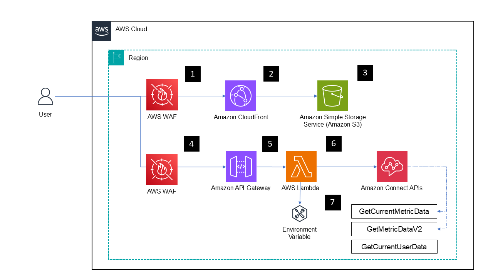

# ITSD-Wallboard

A real-time Amazon Connect call center dashboard displaying live metrics and agent statuses for the SMBC IT Service Desk.



Project is based on the [AWS Wallboard Workshop](https://catalog.us-east-1.prod.workshops.aws/workshops/52554c08-4ebe-401b-b31e-38fc2febac40/en-US)

## Purpose

The ITSD-Wallboard provides a visual display of key contact center metrics including calls in queue, agent availability, and historical performance data. It's designed to be displayed on office wallboards or monitoring screens to give team leads and managers instant visibility into service desk operations.

## Features

### Key Metrics Displayed

**Real-time Metrics:**
- Calls in Queue (Conditianally formatted)
- Calls Abandoned
- Longest Wait Time
- Agents Online / On Call / On Contact

**Historical Metrics (last 24 hours, configurable):**
- Calls Handled
- Overall Agent Answer Rate
- Average Contact Duration

**Agent Status:**
- List of agents with current status


## Architecture

The wallboard solution uses several AWS sevices beyond the base AWS connect instance and queues which are being monitored
- **AWS Route53** optionally for providing easier/humane URLs
- **Amazon CloudFront** for Content delivery
- **AWS WAF** a web application firewall, to limit and control access to the application
- **Amazon S3** as a Static website hosing provider
- **Amazon API Gateway** to publish and manage a RESTful API
- **AWS Lambda** a serverless function, which provide application logic and data access




### Frontend (Route53, Cloudfront, WAF & S3)

Cloudfront provides a method by which the content is delivered (and cached), this can optionally have a WAF ACL attached which can control access and prevent malicious traffic. The type and nature of protections and rules in the ACL should be considered and configured on a case by case basis, and is beyond the scope of this readme.

Optionally a DNS entry can be placed in front of the Cloudfront distribution (in this case https://smbc-itsd-wallboard.smbcdigital.net/wallboard.htm) to provide an easier to remember address.

#### Static web app (`wallboard.html`, `wallboard.css`, `wallboard.js`)

Hosted in S3 the static web app is pretty basic and has 3 main components

- **wallboard.html** - Main HTML structure with semantic markup and accessibility features
- **wallboard.css** - Styling with animations (fade-in, slide-in, pulse effects) and responsive grid layout
- **wallboard.js** - Client-side JavaScript that fetches metrics from the Lambda API and updates the dashboard every 10 seconds

##### API Configuration (Frontend)

Update the API endpoint in `wallboard.js`:
```javascript
const API_CONFIG = {
    endpoint: 'https://your-api-gateway-url.execute-api.region.amazonaws.com/Prod/wallboard',
};
```

##### Conditianal formatting
Metrics can be conditionally formatted, by default "Calls in Queue" is the only value that changes styling depending on value it has warning (orange) and alert/error (pink) states. The thresholds at which formatting changes can be changed in wallboard.js

```js
const callAlertThreshold = 10;
const callWarnThreshold = 5;
```

##### Update Intervals
The wallboard updates itself on a regular interval, the length of the interval can be changed by updating the ```updateInterval``` variable. 
```js
const updateInterval = 10; //In seconds
```

*WARNING*: The lower the value of  ```updateInterval``` the greater then number of calls to to lambda, resulting in higher cost.


## Backend

### API Gateway
The API gateway acts as a middle man enabling managed invocation an retreival of results from the Lambda (see below) .

The /wallboard endpoint is part of the "SMBC ITSD Wallboard" API, designed to serve wallboard functionality for SMBC ITSD. It acts as a REST API interface that connects to backend Lambda processing.

#### Configuration

- **Path**: /wallboard
- **Endpoint Type**: Regional with dual-stack IP support
- **Security**: TLS 1.2, no authentication required
- **CORS**: Enabled for cross-origin access from any domain
- **Access Control**: Public access with IP-based restrictions (blocks specific IP ranges) (meeds reviewing)
- *Integration*: AWS Lambda proxy integration with 29-second timeout

#### Methods
- **GET**: Proxies requests to the "SMBC_ITSD_wallboard_lambda" function
- **OPTIONS**: Handles CORS preflight requests


#### How it works
When a GET request is made to /wallboard, API Gateway forwards it directly to your Lambda function, which processes the request and returns wallboard data (likely in JSON format). The endpoint supports CORS, making it accessible from web browsers for dashboard applications. The configuration suggests this is used for displaying real-time information or metrics on a wallboard/dashboard interface.


### Lambda backend (`lambda.py`)

Backend logic and connectibity to AWS Connect APIs is provided by an AWS Lambda function ```SMBC_ITSD_wallboard_lambda```  that

- retrieves real-time and historical metrics from Amazon Connect queues
- handles CORS preflight requests for cross-origin API calls
- returns JSON with current call queue status, agent metrics, and historical performance data

#### Environment Variables (Lambda)

The behaviour of the Lambda function, the AWS Connect istance and queues which is should query for data + and associated messaging that we might was to place on the wallboard can be set using Envionment variables.

| Variable | Description | Format |
|----------|-------------|--------|
| `ConnectInstanceId` | AWS Connect Instance ID | String |
| `QueueArns` | Comma-delimited list of queue ARNs | `arn:aws:connect:region:account:instance/id/queue/id,...` |
| `WallboardMessage` | Custom message displayed on dashboard | String |

#### IAM Permissions

In order to operate the IAM role ```
SMBC_ITSD_wallboard_lambda-role-viw4foh0``` used to execute the Lambda needs permissions to 

* Create log events
* Access Connect API endpoints

This is provided to by 2 policies

##### Logging permissions
```json
{
    "Version": "2012-10-17",
    "Statement": [
        {
            "Effect": "Allow",
            "Action": "logs:CreateLogGroup",
            "Resource": "arn:aws:logs:eu-west-2:907321154711:*"
        },
        {
            "Effect": "Allow",
            "Action": [
                "logs:CreateLogStream",
                "logs:PutLogEvents"
            ],
            "Resource": [
                "arn:aws:logs:eu-west-2:907321154711:log-group:/aws/lambda/SMBC_ITSD_wallboard_lambda:*"
            ]
        }
    ]
}   
```
#####NOTE - Connect permissions
```json
{
    "Version": "2012-10-17",
    "Statement": [
        {
            "Sid": "VisualEditor0",
            "Effect": "Allow",
            "Action": [
                "connect:GetContactMetrics",
                "connect:GetMetricData",
                "connect:GetCurrentUserData",
                "connect:GetMetricDataV2",
                "connect:GetCurrentMetricData",
                "connect:DescribeUser"
            ],
            "Resource": "*"
        }
    ]
}
``` 


